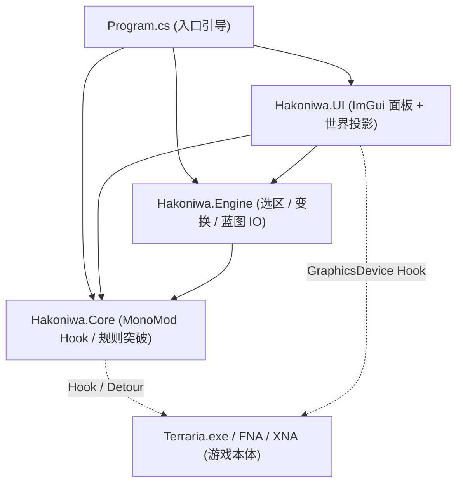

# Hakoniwa 架构与技术设计

## 1. 设计哲学 (KISS / YAGNI / 做减法)

- **单项目高内聚架构**：拒绝过度拆分。单一项目 `Hakoniwa.csproj` 编译为唯一产物 `Hakoniwa.exe`，彻底消灭多 DLL 运行时 `AssemblyResolve` 路径地狱。
- **命名空间清晰隔离**：在项目内部通过 `Core/`、`Engine/`、`UI/` 划分清晰的职责边界。
- **双层渲染架构**：
  - **GUI 交互层**：采用成熟的 `Dear ImGui (ImGui.NET)`，零多余状态，即时模式渲染。
  - **世界投影层**：直接复用游戏原生 `SpriteBatch`，保证与物块网格 100% 像素对齐。
- **现代化 C# 体验**：使用 SDK-Style `.csproj` + `<LangVersion>latest</LangVersion>` + `PolySharp`，在 `net48` 目标下完整享受 C# 12/13 最新语法。

---

## 2. 核心模块与职责划分

### 2.1 Hakoniwa.Core
- 负责 `MonoMod.RuntimeDetour` 与 `MonoMod.ILHook` 的安装与生命周期管理（`HookManager`）。
- 劫持 `Player.tileRangeX/Y`、`Player.PlaceThing`、`WorldGen.PlaceTile` 实现无限放置、防消耗、自由浮空放置。
- 提供安全、统一的世界读写切片接口（`TileAccessor`）。

### 2.2 Hakoniwa.Engine
- **TileDataBlock**：紧凑值类型物块快照结构（12 字节对齐），记录 Tile Type, Wall, Paint, Slope/HalfBlock, Liquid, Wire。
- **TransformEngine**：矩阵旋转（90°/180°/270°）、水平/垂直翻转、平移。
- **ToolEngine**：圆形/矩形/菱形笔刷、带遮罩的 Flood Fill 算法、橡皮擦。
- **SchematicSerializer**：基于 Zstd 压缩的 `.schem` 结构体导入导出。

### 2.3 Hakoniwa.UI
- **ImGuiBackend**：接入 FNA/XNA 的 `GraphicsDevice` 绘制管线与 Win32 输入拦截。
- **Theme**：定制Terraria像素风格主题
- **Windows**：
  - 主工具栏（ToolboxWindow）
  - 蓝图库与切块管理器（SchematicWindow）
  - 世界属性与时间控制（WorldControlWindow）
  - 选区与变换面板（SelectionWindow）
- **WorldOverlay**：在 `Main.Draw` 尾部绘制选区框、刷子准星、幽灵投影。
