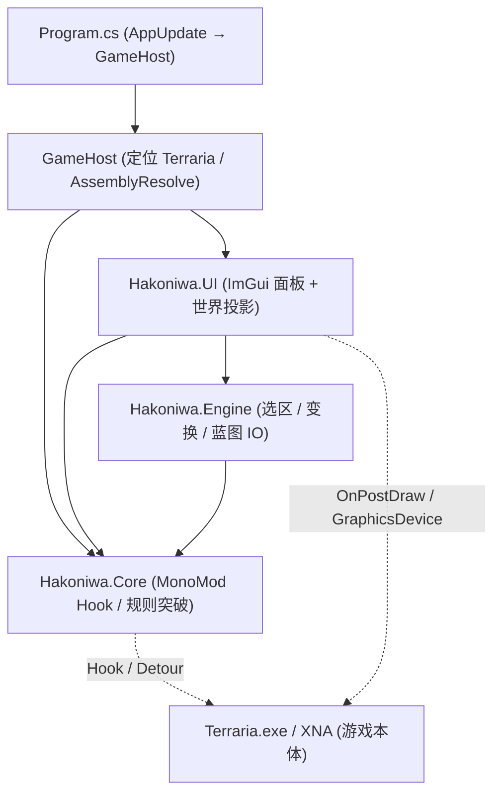

# Hakoniwa 架构与技术设计

## 1. 设计哲学 (KISS / YAGNI / 做减法)

- **单项目高内聚架构**：拒绝过度拆分。单一项目 `Hakoniwa.csproj` 编译为唯一产物 `Hakoniwa.exe`，彻底消灭多 DLL 运行时 `AssemblyResolve` 路径地狱。
- **命名空间清晰隔离**：在项目内部通过 `Core/`、`Engine/`、`UI/` 划分清晰的职责边界。
- **双层渲染架构**：
  - **GUI 交互层**：采用成熟的 `Dear ImGui (Hexa.NET.ImGui)`，零多余状态，即时模式渲染。
  - **世界投影层**：直接复用游戏原生 `SpriteBatch`，保证与物块网格 100% 像素对齐。
- **现代化 C# 体验**：使用 SDK-Style `.csproj` + `<LangVersion>latest</LangVersion>` + `PolySharp`，在 `net48` 目标下完整享受 C# 12/13 最新语法。

---

## 2. 核心模块与职责划分

### 2.1 Hakoniwa.Core (`src/Core/`)
- `GameHost`：定位 `Terraria.exe` 目录、`AssemblyResolve`、加载 `CheatState` / `InventoryPacks`、安装 Hook 与 UI，再 `Terraria.Program.LaunchGame`。
- `AppUpdate`：启动时从 `latest.json` 检查 GitHub Release；`--no-update` / `--updated` 跳过。`dev` 版本不自更新。
- `HookManager`：统一注册 `Hook` / `ILHook`，`Dispose` 时逆序释放。
- `CheatHooks` + `CheatState`：无限达距、防消耗、浮空放置、全图照明（`FullbrightEngine`）、无碰撞（含干燥/湿润碰撞跳过）等运行时规则突破；状态持久化到本地 JSON。
- `MapReveal`：点亮/清除地图探索；联机按 tick 拉取未加载 section。
- `TileAccessor` / `WorldTiles` / `ITileGrid`：统一世界格子读写；`SchematicWorld` 把蓝图粘贴到活世界。
- `ItemCatalog` / `InventoryPacks` / `CharacterPacks` / `CustomWeaponData` / `ItemTooltipExtra`：物品目录、背包套装、角色外观套装、自定义武器与 Tooltip 扩展。
- `NativeTextInput` / `TextEditor` / `NativeTextDraw` / `NativeTextSelect` / `WordBoundary`：游戏内聊天与标牌的光标、选区、撤销与词边界编辑；`ImGuiIme` 切换输入模式。
- `Notices`：游戏内通知事件，UI 侧 `NotifyHost` 消费。

### 2.2 Hakoniwa.Engine (`src/Engine/`)
- `TileDataBlock`：紧凑值类型物块快照（Type / Wall / Paint / Slope / Liquid / Wire）。
- `Selection` + `EditorSession`：选区、剪贴板、幽灵预览与工具会话。`EditorTool.None` 为默认无工具态；Escape 取消粘贴。
- `TransformEngine`：90°/180°/270° 旋转、水平/垂直翻转。
- `ToolEngine`：圆形/矩形/菱形笔刷、带遮罩 Flood Fill、橡皮擦。
- `HistoryStack` + `TileStrokeRecorder`：编辑撤销/重做；同一笔画笔划合并为一次 Undo。
- `Schematic` / `SchematicEntity` + `SchematicSerializer`：Zstd 压缩 `.schem` 导入导出。

### 2.3 Hakoniwa.UI (`src/UI/`)
- `HakoniwaUi`：挂入 `Main.OnEngineLoad` / `OnPostDraw`，统一 Tick、热键（Insert 切换可见性）与窗口生命周期。
- `ImGuiBackend` + `ImGuiIme`：XNA `GraphicsDevice` 绘制管线、Win32 输入与 IME。
- `Themes/HakoniwaTheme`：Terraria 像素风格主题。
- 世界空间：`EditorOverlay` / `SelectionOverlay` / `SchematicDrawer` 在 `OnPostDraw` 绘制选区框、笔刷准星、幽灵物块与蓝图缩略。
- 面板：`StudioWindow`（工坊：`WorldTab`、`CharacterTab`、`SchematicLibrary`、`VanillaDebug`）、`ItemPickerWindow`、`ItemEditorWindow`、`SignEditorWindow`、`IdPicker`、`EditorToolbar`、`FloatingBall`、`ChatOverlay`、`NotifyHost`、`PlayerPreview`。

### 2.4 构建与测试
- 唯一产物：`src/Hakoniwa.csproj` → `Hakoniwa.exe`，`OutputPath` 直接指向 `$(TerrariaDir)`；构建后 `set-laa.ps1` 打 LAA，并拷贝 x86 `cimgui.dll`。
- 共享 SDK：根 `Directory.Build.props`（`net48`、x86、`LangVersion=latest`、PolySharp、`Version`）。
- 发布：`.github/workflows/release.yml` 打 tag 后编译并上传 GitHub Release。
- 测试：`tests/Hakoniwa.Tests/` 覆盖 HookManager、Schematic、TileDataBlock、ToolEngine、TextEditor、ImGui 平台。
